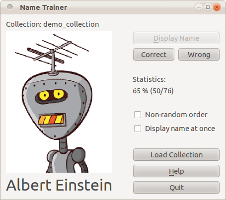

nametrainer
===========

`nametrainer` is a name learning trainer using [Ruby][Ruby] and the [Qt][Qt] GUI toolkit.

It will assist you in learning people's names from a collection of images.

Quick Start
----------

Start the application from the command line with
`nametrainer` or with `nametrainer path_to_collection`.
The program can also be started with a demo collection:
use `nametrainer --demo` or `nametrainer -d`.

With a collection loaded, the application window will look similar to this:

`nametrainer` shows a randomly chosen image.
You can then display the corresponding name and tell the application
whether you know the person's name or you don't know it yet.
Persons that you do not know will be shown more often.

Note that for reasons of speed and convenience it is not necessary
to type in the name (so be honest to yourself).
There are also keyboard shortcuts for "power users" (see the application's `Help`).

Additional settings:

-   Check `Non-random order` to show the images in ordered sequence.

-   Check `Display name at once` to display the names immediately when
    a person is shown.

These settings facilitate quick recapitulation of already learned names
or learning of new names.
Starting the application with `nametrainer --learning-mode` or with
`nametrainer -l` activates both settings.

Collections
-----------

A collection is simply a directory with image files.
`nametrainer` searches in the specified directory for all JPG or PNG files.
It uses the file name as the person's display name unless a corresponding TXT file
is also present. In this case it will use the content of the TXT file as name.

For example, a collection might contain the following files:

>       Albert_Einstein.jpg
>       img1234.jpg
>       img1234.txt
>       Werner_Heisenberg.JPG

Please note:

-   Do not use special characters in file names; use underscore instead of space.
-   Use UTF-8 encoding for TXT files.

Installation
------------

Install from RubyGems.org with `gem install nametrainer`.

You will also have to install Qt bindings for Ruby:

-   On Linux, install the appropriate package for your distribution,
    or compile the bindings using the `qtbindings` gem
    (see the [qtbindings README](https://github.com/ryanmelt/qtbindings#readme)
    for instructions).

-   On Windows, the `qtbindings` gem should get you up and running.

Acknowledgements
----------------

The images for the demo collection were taken from [robohash.org](http://robohash.org/).

Reporting bugs
--------------

Report bugs on the `nametrainer` home page: <https://github.com/stomar/nametrainer/>

License
-------

Copyright &copy; 2012-2014 Marcus Stollsteimer

`nametrainer` is free software: you can redistribute it and/or modify
it under the terms of the GNU General Public License version 3 or later (GPLv3+),
see [www.gnu.org/licenses/gpl.html](http://www.gnu.org/licenses/gpl.html).
There is NO WARRANTY, to the extent permitted by law.

[Ruby]: http://www.ruby-lang.org/
[Qt]:   http://qt-project.org/
